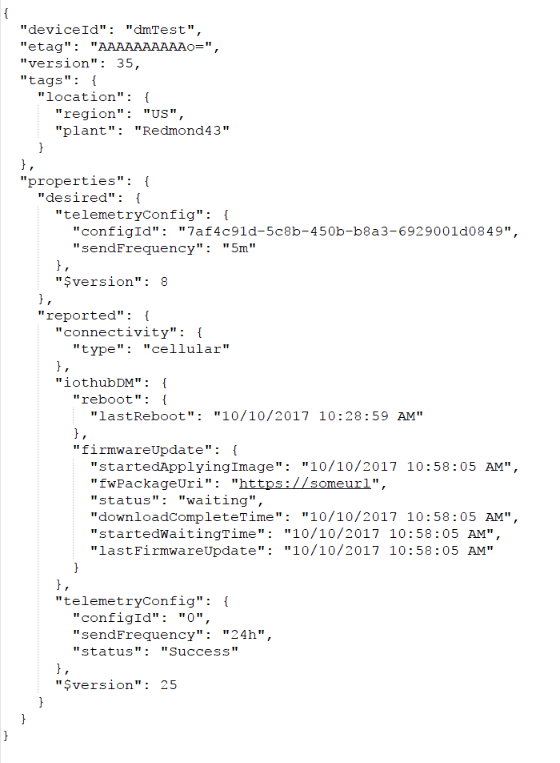
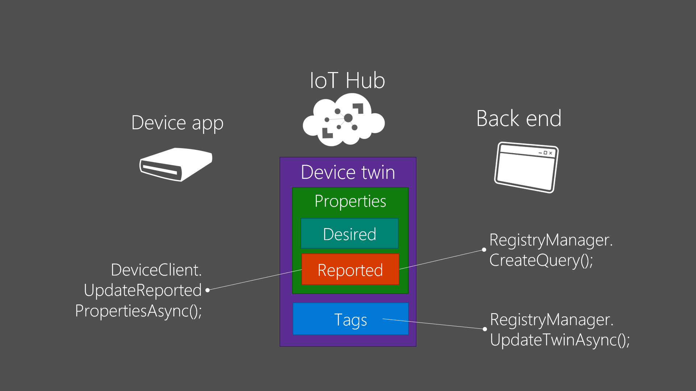

# Azure Device Twins Sample source 
Sometime, examining the source code is more efficient, straightforward than reading docs to understand how it works. This example helps you to understand how Azure Twin works with Azure Device management APIs. 

If you need more specific information, visit the MS Doc site https://docs.microsoft.com/en-us/azure/iot-hub/iot-hub-csharp-csharp-twin-getstarted. Please note that I wrote this code before MS release .NET back end .NET device source. Therefore, the source is little bit different from the docs site but similar.
 
Below’s APIs are particular new APIs for Device Twins management. It might be helpful to look over those APIs descriptions before you compile and implement samples.  

### Device side 
 DeviceClient. UpdatedReportedPropertiesAsync
 
 DeviceClient. SetMethodHandlerAsync(MethodCallback) 

 DeviceClient. SetDesiredPropertyUpdateCallback(DesiredPropertyUpdateCallback)

### Back end side 
 RegistryManager. CreateQuery
 
 RegistryManager. UpdateTwinAsync
 
 RegistryManager. GetTwinAsync
 
 ServiceClient. InvokeDeviceMethodAsync 

## What is Device Twins? 
Device twins are JSON documents that store device state information (metadata, configurations, and conditions). IoT Hub persists a device twin for each device that you connect to IoT Hub. Device twin’s JSON documents have tags, desired and reported properties. 

If you finish all the sample, your device’s device twin JSON doc would look like below ( skipped all metadata ) 

 

## TwinsTagProperties
ReportConnectivity ( Device app ) : update reported “connectivity”property 
 
 "reported": {
      "connectivity": {
        "type": "cellular"
      },

AddtagsAndQuery (Back end ) : update twins tags and read the changed reported property 

"tags": {
    "location": {
      "region": "US",
      "plant": "Redmond43"
    }
  },

 

